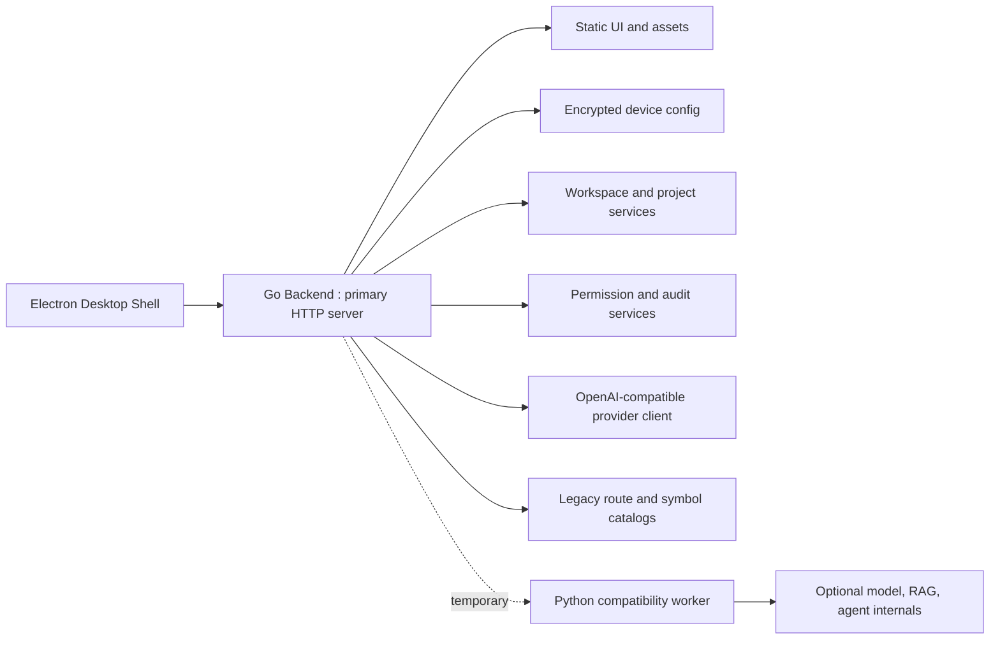

# KaguyaIDE 3.1.0 Desktop Backend Refactor

更新时间：2026-05-15

这个仓库当前是 Windows 桌面发行包源码修复态，不是干净的新项目。当前工程目标很明确：把旧 Python 单体后端逐步拆成标准 Go 后端服务，Python 只保留为临时兼容 worker，最终删除旧单体入口。

不要把本文档理解成“已经完全迁移完成”。真实状态以测试和脚本输出为准。

## 当前结论

- Electron 桌面壳仍在 `resources/app.asar.src/electron`。
- 新 Go 后端在 `resources/go-backend`。
- 旧 Python 后端仍保留在 `resources/python-app`，作为迁移来源和兼容 worker。
- Go 后端已经拥有 legacy HTTP route 的完整映射表。
- Go 源码已拆出 Auth、Provider Chat、Agent Runtime、Workspace、Terminal Permission、RAG/KB、Security/Privacy 等服务文件。
- 旧 Python 单体还不能物理删除，因为部分行为仍是 structured unavailable 或兼容 worker 模式。

## 目录结构

```text
KaguyaIDE-3.1.0-win64-Desktop
├── Kaguya IDE.exe
├── main.js
├── resources
│   ├── app.asar
│   ├── app.asar.src
│   │   └── electron
│   │       ├── main.js
│   │       └── preload.js
│   ├── go-backend
│   │   ├── main.go
│   │   ├── server.go
│   │   ├── *_service.go
│   │   ├── *_test.go
│   │   ├── route_contract_generated.go
│   │   ├── legacy_symbol_catalog_generated.go
│   │   └── kaguya-go-backend.exe
│   └── python-app
│       ├── kaguya_*.py
│       ├── tests
│       └── scripts
├── docs
├── AUDIT_NOTES.md
├── IPC_CONTRACT.md
└── README.md
```

## 后端架构



## Go 后端拆分

| 文件 | 职责 |
| --- | --- |
| `main.go` | Go 后端进程入口、CLI 参数、HTTP listen |
| `server.go` | 当前 HTTP router 和仍待继续拆出的 glue 层 |
| `auth_account_service.go` | 本地桌面账号、session、token/admin 兼容结构 |
| `provider_chat_service.go` | Kimi/Moonshot、DeepSeek、OpenAI-compatible provider client |
| `agent_runtime_service.go` | Agent run registry、run id、abort、task tree、SSE frame |
| `workspace_project_service.go` | Workspace 路径授权、项目元数据、文件快照 |
| `terminal_permission_service.go` | 命令风险分类、权限决策、审计结构 |
| `knowledge_rag_service.go` | 本地 KB/RAG 文档库、search、stats、preview/delete |
| `security_privacy_service.go` | loopback policy、privacy settings/export/delete |
| `route_contract_generated.go` | legacy route 删除门禁契约 |
| `legacy_symbol_catalog_generated.go` | legacy Python symbol 删除门禁契约 |

当前 Go 源码行数超过 3 万行，其中大块 generated contract 是有意保留的迁移门禁，不是业务手写代码。

## Provider / Kimi 配置

Go 后端支持 OpenAI-compatible provider 调用。Kimi/Moonshot 默认配置：

```json
{
  "provider": "kimi",
  "api_url": "https://api.moonshot.ai/v1",
  "model": "kimi-k2.6",
  "api_key": "..."
}
```

支持 camelCase 和 snake_case：

```json
{
  "provider": "kimi",
  "apiUrl": "https://api.moonshot.ai/v1",
  "apiKey": "...",
  "model": "kimi-k2.6"
}
```

敏感字段规则：

- `api_key` / `apiKey` 不能明文返回给网页。
- 保存配置后，读取接口只能返回 masked key。
- Go provider client 会把 key 放到 `Authorization: Bearer ...`，不会把 key 转发进上游 JSON body。

## 关键 API

### 配置和设备

| 方法 | 路径 | 状态 |
| --- | --- | --- |
| `GET` | `/api/config` | Go |
| `POST` | `/api/config` | Go |
| `GET` | `/api/model-status` | Go |
| `GET` | `/api/device/info` | Go |
| `POST` | `/api/device/bind` | Go |
| `POST` | `/api/device/unbind` | Go |
| `GET` | `/api/account/saved-config` | Go |
| `GET` | `/api/account/auto-fill` | Go |

### Chat

| 方法 | 路径 | 状态 |
| --- | --- | --- |
| `POST` | `/api/chat` | Go provider 或 Python worker |
| `POST` | `/chat` | Go provider 或 Python worker |
| `POST` | `/chat/completions` | OpenAI-compatible |
| `POST` | `/stream` | Python worker 或 structured unavailable |

### Agent 和文件

| 方法 | 路径 | 状态 |
| --- | --- | --- |
| `POST` | `/agent/run` | Go fallback + Python worker |
| `POST` | `/agent/abort` | Go/Python abort contract |
| `GET` | `/agent/tasks` | Go |
| `POST` | `/agent/read-file` | Go workspace guard |
| `POST` | `/agent/write-file` | Go workspace guard |
| `POST` | `/agent/upload-device-files` | Go workspace guard |
| `POST` | `/agent/terminal/exec` | Go permission guard |

### RAG / KB

| 方法 | 路径 | 状态 |
| --- | --- | --- |
| `GET` | `/rag/documents` | Go fallback |
| `POST` | `/rag/add_text` | Python worker 或 structured unavailable |
| `POST` | `/kb/add` | Go local KB |
| `POST` | `/kb/search` | Go local KB |

## 安全边界

必须保持这些规则：

- 桌面模式不等于无限文件权限。
- 文件读写必须限制在 workspace 或用户确认导入的项目目录。
- 路径判断必须使用 real path / common path 语义，不能用 startswith。
- 终端执行默认 `shell=false`。
- 高危命令必须经过权限判断，拒绝也要写 audit。
- 非 loopback 请求不能访问高危桌面 API。
- API key、token、密码不能明文写入响应。
- mini/fallback 模式不能假装完整后端可用。

## 运行检查

Python 后端基础检查：

```powershell
python -m compileall .\resources\python-app
python -m unittest discover -s .\resources\python-app\tests -v
```

Electron 语法检查：

```powershell
node --check .\resources\app.asar.src\electron\main.js
node --check .\resources\app.asar.src\electron\preload.js
```

Go 后端检查：

```powershell
cd .\resources\go-backend
..\..\.tools\go\bin\go.exe test ./...
..\..\.tools\go\bin\go.exe build -o kaguya-go-backend.exe .
```

Route coverage gate：

```powershell
python .\resources\python-app\scripts\go_route_coverage.py --fail-under 100
```

Generated contract 更新：

```powershell
python .\resources\python-app\scripts\generate_go_route_contract.py
python .\resources\python-app\scripts\generate_go_legacy_symbol_catalog.py
```

## 物理删除旧 Python 单体的门禁

删除前必须全部满足：

1. Go route coverage 为 100%。
2. Go symbol catalog 中高危 symbol 已有 Go 行为测试或明确退役说明。
3. Chat、Agent run/abort、workspace file、terminal、RAG/KB、auth/security、privacy、workflow 的 Go 测试通过。
4. Electron 启动链路默认走 Go 后端。
5. Python 只作为可选 worker，不再作为 HTTP 主入口。
6. README、docs、Electron 启动日志不再把旧单体作为架构名称。
7. 删除旧文件后仍能通过 Go test、Python smoke、Node check 和桌面 smoke。

## 当前未完成项

- `server.go` 仍是 router + glue，需要继续把 handler 接到各 service。
- 部分 legacy route 仍返回 structured unavailable。
- RAG 深度分析、MCP、workflow 执行、多模态、finetune 还没有完整 Go 行为等价。
- Electron 桌面完整点击链路还需要真实启动 smoke。
- 旧 Python 单体还没有达到可物理删除状态。

## GitHub

当前上传目标：

[https://github.com/MouFush/Kaguya](https://github.com/MouFush/Kaguya)

不要直接整包覆盖已有仓库。提交必须说明修复范围，并附带测试结果。
