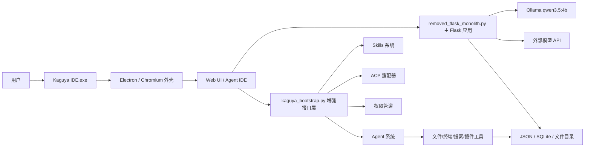

# Kaguya IDE 3.1.0 整体项目文档

更新时间：2026-04-27  
项目目录：`C:\Users\Lanzao\Downloads\KaguyaIDE-3.1.0-win64-Desktop`  
当前形态：Windows Electron 桌面应用分发包  
应用版本：`Kaguya IDE.exe` 文件版本 `3.1.0`，产品版本 `3.1.0.0`

## 1. 项目概览

Kaguya IDE 是一个桌面端 AI IDE/AI 助手应用。当前目录不是源码仓库，而是一个已经打包好的 Windows 可执行分发包。它由 Electron 桌面外壳、Chromium/Electron 运行时文件、`app.asar` 前端资源包，以及 `resources\python-app` 下的 Python/Flask 后端组成。

从现有代码看，Kaguya IDE 的核心定位是：

- 提供本地 AI 聊天和流式对话能力，默认面向 Ollama 的 `qwen3.5:4b` 模型。
- 提供可视化 IDE 工作区能力，包括文件树、读写文件、项目运行、编译、终端命令执行和审计。
- 提供 Agent 能力，包括工具调用、权限审批、任务管理、插件、浏览器搜索、终端执行和文件分析。
- 提供知识库、RAG 检索、工作流、MCP 插件、多模态、微调、项目中心、运营面板、发布管理、告警、A/B 实验和集成管理等功能模块。
- 提供账号、会话、令牌、安全审计、IP 白名单、2FA 设置入口等安全能力。

当前包更接近“功能完整的本地桌面发行版”，不是一个干净的开发源码工程。维护时要注意：运行数据、缓存、账号信息、密钥、SQLite 数据库和生成日志都直接位于 `resources\python-app` 下。

## 2. 顶层目录结构

```text
KaguyaIDE-3.1.0-win64-Desktop
├── Kaguya IDE.exe                  # Windows 桌面端入口
├── resources
│   ├── app.asar                    # Electron 应用资源包
│   └── python-app                  # Python/Flask 后端和业务模块
├── locales                         # Chromium 多语言资源
├── chrome_*.pak                    # Chromium 资源
├── *.dll                           # Electron/Chromium 运行时 DLL
├── icudtl.dat
├── resources.pak
├── LICENSE.electron.txt
├── LICENSES.chromium.html
└── README.md                       # 本文档
```

顶层目录没有 `.git`，所以当前包不能直接进行 Git 分支、提交、PR 等源码仓库操作。若要长期维护，建议找到原始源码仓库，而不是直接在分发包上持续开发。

## 3. 技术栈

| 层级 | 技术/组件 | 说明 |
| --- | --- | --- |
| 桌面外壳 | Electron/Chromium | `Kaguya IDE.exe` 与运行时 DLL 提供桌面容器 |
| 前端资源 | `resources\app.asar`，Flask 内嵌 HTML/JS，`static` 资源 | 部分界面可能由 Electron 资源加载，部分由 Flask 直接返回 |
| 后端框架 | Flask | `removed_flask_monolith.py` 和 `kaguya_bootstrap.py` 都提供 Flask 路由 |
| 默认模型后端 | Ollama | 默认模型名 `qwen3.5:4b`，默认地址 `http://localhost:11434` |
| 外部模型 | DeepSeek/OpenAI/Claude/Kimi 等 | 通过 `external_api` 和账号级配置保存 |
| 存储 | JSON 文件、SQLite、文件目录 | 项目配置、账号、RAG、记忆、审计、工作流等分散存储 |
| Agent/工具 | Python 模块化实现 | 文件、终端、权限、技能、ACP、MCP、浏览器搜索等 |
| 可选依赖 | PyTorch、PEFT、OpenSSL、pyngrok 等 | 按功能分支动态使用 |

## 4. 总体架构



系统有两个主要 Flask 入口：

- `resources\python-app\removed_flask_monolith.py`：主应用，包含聊天、RAG、知识库、工作流、MCP、项目中心、Agent IDE 等大量业务接口。
- `resources\python-app\kaguya_bootstrap.py`：增强引导层，负责初始化 feature flags、hooks、权限、agents、skills、accounts、ACP、tool executor，并注册增强 API。

`start_server.py` 是一个轻量启动脚本，优先调用 `kaguya_bootstrap.run_kaguya_server()`，如果导入失败则回退到直接加载 `removed_flask_monolith.py`。

## 5. 启动方式

### 5.1 桌面启动

双击或运行：

```powershell
.\Kaguya IDE.exe
```

这是面向普通用户的入口。Electron 负责启动桌面窗口，具体是否同时拉起 Python 服务由 `app.asar` 内部逻辑决定。当前没有解包 `app.asar`，因此 Electron 主进程细节未在本文档中展开。

### 5.2 后端增强接口启动

```powershell
cd C:\Users\Lanzao\Downloads\KaguyaIDE-3.1.0-win64-Desktop\resources\python-app
python -B kaguya_bootstrap.py --host 127.0.0.1 --port 5000
```

启动后可访问：

```text
http://127.0.0.1:5000/kaguya/system/status
http://127.0.0.1:5000/agents/list
http://127.0.0.1:5000/skills/list
http://127.0.0.1:5000/permissions/status
```

### 5.3 主 Web 应用启动

```powershell
cd C:\Users\Lanzao\Downloads\KaguyaIDE-3.1.0-win64-Desktop\resources\python-app
python -B removed_flask_monolith.py --localhost-only --port 5000
```

常用参数：

| 参数 | 说明 |
| --- | --- |
| `--port` | 服务端口，默认读取 `KAGUYA_PORT`，否则为 `5000` |
| `--host` | 绑定地址，默认 `0.0.0.0` |
| `--localhost-only` | 强制绑定 `127.0.0.1`，建议本地使用时开启 |
| `--https` | 启用 HTTPS |
| `--cert` | 指定 SSL 证书 |
| `--key` | 指定 SSL 私钥 |

安全提示：`removed_flask_monolith.py` 默认 host 是 `0.0.0.0`，如果不加 `--localhost-only`，局域网可能可以访问。开发和个人使用建议优先使用 `--localhost-only`。

### 5.4 Ollama 准备

默认模型后端是 Ollama：

```text
base_url: http://localhost:11434
model: qwen3.5:4b
```

启动前建议确认：

```powershell
ollama list
ollama pull qwen3.5:4b
ollama serve
```

如果 Ollama 未运行，聊天、RAG 生成、场景生成等模型相关功能会失败或降级。

## 6. Python 后端目录说明

`resources\python-app` 是当前项目最重要的业务目录。

| 路径 | 作用 |
| --- | --- |
| `.kaguya` | Kaguya 内部配置、账号、skills 等增强系统数据 |
| `assets` | 欢迎图、头图、hero 图等静态图片 |
| `audio_cache` | TTS 音频缓存 |
| `audit_logs` | Agent 和安全审计日志 |
| `code_executions` | 代码执行器临时/结果目录 |
| `data` | 通用数据、密钥、项目配置 |
| `external_api` | 外部模型供应商配置 |
| `finetune` | 微调数据集、训练和导出目录 |
| `ide_workspaces` | IDE 用户工作区 |
| `kaguya_core` | 抽象后的核心框架模块 |
| `knowledge_base` | 简易知识库数据 |
| `lora_adapters` | LoRA 适配器目录 |
| `mcp_plugins` | MCP 插件配置与资源 |
| `memory_system` | 记忆系统数据，当前包含 `memory.db` |
| `multimodal` | 多模态上传和图片缓存 |
| `project_center` | 项目中心、任务、playbooks、运营数据 |
| `prompts` | Prompt 模板目录 |
| `rag_data` | RAG 文档、分块、索引与缓存 |
| `security_data` | 安全数据，当前包含 revoked token 数据库 |
| `static` | CSS/JS 静态资源 |
| `uploads` | 用户上传文件 |
| `workflows` | 工作流定义和索引 |
| `__pycache__` | Python 字节码缓存 |

## 7. 核心 Python 模块

| 文件 | 主要职责 |
| --- | --- |
| `removed_flask_monolith.py` | 主 Web 应用，约 249 个 Flask 路由，覆盖聊天、RAG、Agent IDE、项目中心、权限、安全、工作流等功能 |
| `start_server.py` | 启动脚本，优先启动增强引导层，失败时回退到主应用 |
| `ollama_adapter.py` | Ollama API 适配器，封装 chat、stream、generate、embeddings，并兼容原模型接口 |
| `kaguya_bootstrap.py` | 增强系统引导层，统一加载 feature flags、hooks、permissions、agents、skills、accounts、ACP、tool executor |
| `kaguya_accounts.py` | 账户系统，包含用户角色、权限、密码、JWT、CSRF、XSS、SQL 注入防护、限流、审计 |
| `kaguya_acp.py` | ACP 协议适配器，包含会话、消息总线、HTTP bridge、agent、权限选项等 |
| `kaguya_agents.py` | 子代理系统，包含 agent 定义、注册、执行、异步运行、隔离和记忆范围 |
| `kaguya_skills.py` | Skills 框架，包含 frontmatter 解析、技能加载、技能执行 |
| `kaguya_permissions.py` | 权限决策管道，包含命令安全校验、规则存储、拒绝追踪、审计和待审批请求 |
| `kaguya_tool_executor.py` | 并发工具执行器，支持任务优先级、资源监控、hook、流式执行 |
| `kaguya_tool_system.py` | 结构化工具系统，提供读写文件、编辑文件、Bash、Glob、Grep 等工具 |
| `kaguya_terminal.py` | 终端命令分析和安全执行 |
| `kaguya_file_operations.py` | 安全文件读写、历史、编码/换行检测、路径建议、目录树渲染 |
| `kaguya_file_analyzer.py` | 文件组织和依赖分析，提供文件分类、依赖图、结构建议 |
| `kaguya_file_history.py` | 文件历史和撤销系统 |
| `kaguya_memory.py` | 增强记忆系统，包含工作记忆、长期记忆、提取和检索 |
| `kaguya_hooks.py` | Hook 系统，支持工具执行前后、错误、权限等扩展点 |
| `kaguya_feature_flags.py` | 特性开关系统 |
| `kaguya_frontend.py` | 前端 JS/HTML 注入模块 |
| `kaguya_compaction.py` | 对话压缩系统 |
| `kaguya_thinking.py` | 增强思维链管理 |
| `kaguya_project_instructions.py` | 项目指令加载系统 |
| `kaguya_enhanced_features_v2.py` | 增强功能 V2，包含 MCP、深度研究、多 Agent 编排、指标收集等 |
| `kaguya_enhanced_features_v3.py` | 增强功能 V3，包含观测、MCP V2、Research V2、Agent V2 等 |
| `kaguya_enhanced_v2_integration.py` | 增强功能 V2 与 Flask 路由集成 |
| `kaguya_security_framework_v2.py` | 企业级安全框架 |
| `kaguya_optimization_suite.py` | 性能、缓存、连接池、重试、健康检查、结构化日志等优化套件 |

## 8. `kaguya_core` 基础框架

`kaguya_core` 是抽象后的基础框架目录，目标是把通用能力从单体业务文件中拆出来。

| 文件 | 主要职责 |
| --- | --- |
| `config.py` | 统一配置管理，支持 JSON/YAML/环境变量 |
| `models.py` | 通用数据模型，例如用户、会话、APIKey、消息、任务、指标 |
| `exceptions.py` | 统一异常类型，例如认证、授权、限流、数据库、外部服务异常 |
| `logging.py` | 结构化日志与日志配置 |
| `utils.py` | ID、token、时间、字符串清洗、JSON、安全脱敏、相似度、限流等工具 |
| `base_manager.py` | Singleton 和 ManagerRegistry 管理器模式 |
| `audit_system_refactored.py` | 重构版审计日志 |
| `security_framework_refactored.py` | 重构版安全框架 |
| `claw_code_ref` | 参考实现，包含 history、query engine、runtime、session store、transcript |

建议后续开发优先把新增公共能力放入 `kaguya_core`，逐步降低 `removed_flask_monolith.py` 的单体复杂度。

## 9. 功能模块说明

### 9.1 聊天与模型调用

主聊天链路位于 `removed_flask_monolith.py`。默认通过 `ollama_adapter.py` 调用 Ollama：

- 默认模型：`qwen3.5:4b`
- 默认 Ollama 地址：`http://localhost:11434`
- 支持普通 chat、stream chat、generate、stream generate、embeddings。
- 支持通过外部 API 配置切换 DeepSeek、OpenAI、Claude、Kimi 等供应商。
- 支持角色系统、Prompt 模板、结构化输出模板、场景提示词、MCP system prompt。

主要接口：

| 接口 | 说明 |
| --- | --- |
| `POST /chat` | 普通聊天 |
| `POST /stream` | 流式聊天 |
| `POST /deepseek/chat` | DeepSeek 风格聊天接口 |
| `POST /deepseek/test` | 连接测试 |
| `GET /external/config` | 获取外部供应商配置 |
| `POST /external/config` | 保存外部供应商配置 |
| `POST /external/test` | 测试外部供应商 |

### 9.2 RAG 与知识库

RAG 功能集中在 `removed_flask_monolith.py` 前半部分，使用文件解析、分块、TF-IDF、BM25、混合检索、重排、缓存和元数据过滤。

关键能力：

- 文档上传、文本添加、批量上传。
- 智能分块，支持按字符、段落等策略处理。
- TF-IDF embedding 与余弦相似度。
- BM25 检索。
- Hybrid search 和 reciprocal rank fusion。
- 查询扩展、查询改写、多查询生成、问题拆解。
- 元数据过滤、时间权重、迭代检索。
- RAG cache，默认缓存上限 100。

主要数据：

- `rag_data\rag_index.json`
- `rag_documents`
- `rag_chunks`
- `rag_embeddings`
- `rag_doc_hashes`

主要接口：

| 接口 | 说明 |
| --- | --- |
| `POST /rag/upload` | 上传文档 |
| `GET /rag/documents` | 文档列表 |
| `DELETE /rag/delete/<doc_id>` | 删除文档 |
| `POST /rag/search` | RAG 检索 |
| `GET /rag/preview/<doc_id>` | 文档预览 |
| `GET /rag/chunk/<chunk_id>` | 查看分块 |
| `GET /rag/stats` | RAG 统计 |
| `POST /rag/clear_cache` | 清理 RAG 缓存 |
| `POST /rag/batch_upload` | 批量上传 |
| `POST /rag/add_text` | 添加文本 |
| `GET /rag/analysis` | RAG 分析 |
| `POST /rag/build-graph` | 构建 RAG 图谱 |

### 9.3 Agent IDE

Agent IDE 是面向开发和自动化工作的界面，相关接口集中在 `/agent/*`。

关键能力：

- 识别用户和账号。
- 打开项目、查看项目状态、运行/停止项目。
- 浏览目录、读取文件、写入文件、回滚文件。
- 导入文件、导入环境、上传设备文件。
- 编译代码、运行项目、读取输出。
- 执行终端命令、终止终端进程。
- 权限审批、权限配置、沙箱目录、规则管理。
- Agent 任务管理和任务树。
- 浏览器搜索、网页抓取、打开网页。

代表接口：

| 接口 | 说明 |
| --- | --- |
| `GET /agent-ide` | Agent IDE 页面 |
| `POST /agent/identify` | 用户识别 |
| `POST /agent/open-project` | 打开项目 |
| `POST /agent/file-tree` | 获取文件树 |
| `POST /agent/read-file` | 读取文件 |
| `POST /agent/write-file` | 写入文件 |
| `POST /agent/revert-file` | 回滚文件 |
| `POST /agent/run-project` | 运行项目 |
| `POST /agent/stop-project` | 停止项目 |
| `POST /agent/project-output` | 获取项目输出 |
| `POST /agent/compile` | 编译 |
| `POST /agent/terminal/exec` | 执行终端命令 |
| `POST /agent/terminal/kill` | 停止终端命令 |
| `GET /agent/system/info` | 系统信息 |
| `GET /agent/accounts` | 账号列表 |

### 9.4 工具调用与权限

工具系统分为两套：

- 主应用内置工具：`removed_flask_monolith.py`、`kaguya_tool_system.py`、`kaguya_terminal.py`、`kaguya_file_operations.py`。
- 增强引导层工具执行器：`kaguya_tool_executor.py`。

权限系统由 `kaguya_permissions.py` 提供，核心概念包括：

- `PermissionMode`：权限模式。
- `PermissionRule`：允许/拒绝/信任规则。
- `PermissionRequest`：待审批请求。
- `PermissionPipeline`：权限决策管道。
- `CommandSafetyValidator`：命令安全校验。
- `DenialTracker`：拒绝记录和追踪。
- `PermissionAuditEntry`：权限审计记录。

增强层主要接口：

| 接口 | 说明 |
| --- | --- |
| `GET /permissions/status` | 权限系统状态 |
| `GET,POST /permissions/mode` | 查看或修改权限模式 |
| `GET /permissions/request` | 待审批请求 |
| `POST /permissions/respond` | 响应权限请求 |
| `GET,POST,DELETE /permissions/trust-rules` | 信任规则管理 |
| `GET /permissions/audit` | 权限审计 |
| `POST /permissions/cancel` | 取消请求 |
| `GET /permissions/sse` | 权限事件流 |
| `POST /permissions/check` | 单次权限检查 |

主应用 V2 权限接口：

| 接口 | 说明 |
| --- | --- |
| `GET /agent/v2/permissions/stats` | 权限统计 |
| `GET,POST /agent/v2/permissions/mode` | 权限模式 |
| `GET /agent/v2/permissions/denials` | 拒绝记录 |
| `GET /agent/v2/permissions/audit` | 审计记录 |
| `GET,POST,DELETE /agent/v2/permissions/rules` | 权限规则 |
| `GET /agent/v2/permissions/pending` | 待审批列表 |
| `POST /agent/v2/permissions/respond` | 审批响应 |
| `POST /agent/v2/command-safety` | 命令安全检查 |

### 9.5 账户、安全与审计

账户系统存在两套接口：

- `/auth/*`：主应用账号接口。
- `/kaguya/auth/*`：增强层账号接口。

主要能力：

- 登录、登出、全端登出。
- 注册、token 生成。
- 密码重置请求和确认。
- 账号资料读取和更新。
- 管理员账号列表和角色修改。
- 初始 setup。
- IP 白名单。
- 安全 header。
- 请求大小限制。
- 安全事件审计。
- 令牌撤销数据库。
- 2FA 设置入口。

代表接口：

| 接口 | 说明 |
| --- | --- |
| `GET,POST /auth/login` | 登录 |
| `POST /auth/logout` | 登出 |
| `POST /auth/logout-all` | 全部会话登出 |
| `POST /auth/register` | 注册 |
| `POST /auth/token` | 生成 token |
| `GET,PUT /auth/account` | 账号资料 |
| `GET /auth/admin/accounts` | 管理员账号列表 |
| `POST /auth/admin/role` | 修改角色 |
| `GET,POST /auth/setup` | 初始化设置 |
| `GET,POST,DELETE /security/ip-whitelist` | IP 白名单 |
| `POST /security/ip-whitelist/mode` | IP 白名单模式 |
| `GET /security/audit` | 安全审计 |
| `GET /security/status` | 安全状态 |
| `POST /security/audit/clear` | 清理审计 |
| `GET,POST /security/2fa/setup` | 2FA 设置 |

### 9.6 MCP 插件

MCP 插件功能由主应用和增强模块共同提供。主应用接口位于 `/mcp/*`。

主要能力：

- 插件列表。
- 插件详情。
- 启用/禁用插件。
- 更新插件配置。
- 执行 MCP 工具。
- 获取已启用工具列表。

接口：

| 接口 | 说明 |
| --- | --- |
| `GET /mcp/plugins` | 插件列表 |
| `GET /mcp/plugin/<plugin_id>` | 插件详情 |
| `POST /mcp/plugin/<plugin_id>/enable` | 启用/禁用 |
| `POST /mcp/plugin/<plugin_id>/config` | 更新配置 |
| `POST /mcp/execute` | 执行工具 |
| `GET /mcp/tools` | 已启用工具列表 |

### 9.7 Workflow 工作流

工作流定义存储在 `workflows` 目录。

接口：

| 接口 | 说明 |
| --- | --- |
| `GET /workflow/node-types` | 节点类型 |
| `GET /workflows` | 工作流列表 |
| `GET /workflow/<workflow_id>` | 工作流详情 |
| `POST /workflow` | 创建工作流 |
| `DELETE /workflow/<workflow_id>` | 删除工作流 |
| `POST /workflow/<workflow_id>/execute` | 执行指定工作流 |
| `POST /workflow/execute` | 执行临时工作流 |

### 9.8 记忆系统

记忆系统有主应用内置版本和 `kaguya_memory.py` 增强版本。当前目录中存在 SQLite 数据库：

```text
resources\python-app\memory_system\memory.db
```

接口：

| 接口 | 说明 |
| --- | --- |
| `GET /memory/stats` | 记忆统计 |
| `POST /memory/search` | 搜索记忆 |
| `POST /memory` | 添加记忆 |
| `DELETE /memory/<memory_id>` | 删除记忆 |
| `PUT /memory/<memory_id>/pin` | 置顶/取消置顶 |
| `GET /memory/profile` | 用户画像 |
| `POST /memory/profile` | 更新用户画像 |
| `POST /memory/consolidate` | 整理记忆 |

### 9.9 多模态

多模态功能位于 `multimodal` 目录和相关接口。

接口：

| 接口 | 说明 |
| --- | --- |
| `POST /multimodal/upload` | 上传图片 |
| `POST /multimodal/analyze` | 图片分析 |
| `POST /multimodal/chat` | 多模态聊天 |
| `GET /multimodal/history` | 多模态历史 |
| `POST /multimodal/clear` | 清空历史 |

### 9.10 微调平台

微调数据位于：

```text
resources\python-app\finetune
├── datasets
├── training
└── exports
```

接口：

| 接口 | 说明 |
| --- | --- |
| `GET /finetune/datasets` | 数据集列表 |
| `POST /finetune/dataset/upload` | 上传数据集 |
| `DELETE /finetune/dataset/<dataset_id>` | 删除数据集 |
| `GET /finetune/jobs` | 任务列表 |
| `POST /finetune/job` | 创建任务 |
| `POST /finetune/job/<job_id>/start` | 启动任务 |
| `POST /finetune/job/<job_id>/stop` | 停止任务 |
| `GET /finetune/job/<job_id>` | 任务状态 |
| `DELETE /finetune/job/<job_id>` | 删除任务 |
| `GET /finetune/job/<job_id>/logs` | 任务日志 |

### 9.11 项目中心

项目中心数据位于 `project_center`，当前已有 `playbooks.json`，内置 6 个 playbook：

- 增长周计划
- 故障应急响应
- 发布门禁清单
- 深度研究简报
- 销售赋能作战卡
- 合规评审模板

主要能力：

- 项目总览、统计、导入导出、清理。
- Prompt 模板、自定义模板、收藏和使用统计。
- Artifacts 管理和版本恢复。
- 任务、里程碑、风险、活动流。
- Playbook 运行。

代表接口：

| 接口 | 说明 |
| --- | --- |
| `GET,POST /project/config` | 项目配置 |
| `GET /project/stats` | 项目统计 |
| `GET /project/export` | 项目导出 |
| `POST /project/import` | 项目导入 |
| `POST /project/clear` | 项目清理 |
| `GET /project/overview` | 项目总览 |
| `GET,POST /artifacts` | Artifact 列表/创建 |
| `PUT /artifacts/<artifact_id>` | 更新 Artifact |
| `POST /artifacts/<artifact_id>/restore` | 恢复版本 |
| `GET,POST /project/tasks` | 任务列表/创建 |
| `POST /project/tasks/<task_id>/status` | 更新任务状态 |
| `GET,POST /playbooks` | Playbook 列表/创建 |
| `POST /playbooks/<playbook_id>/run` | 运行 Playbook |
| `GET,POST /project/milestones` | 里程碑 |
| `GET,POST /project/risks` | 风险 |

### 9.12 运营、发布、告警、A/B、集成

这些模块集中在 `removed_flask_monolith.py` 后半部分，面向项目运营和治理。

| 模块 | 代表接口 |
| --- | --- |
| 运营 | `GET /ops/overview`，`GET,POST /ops/campaigns` |
| 发布 | `GET /release/overview`，`GET,POST /release/plans`，`POST /release/plans/<plan_id>/check` |
| 告警 | `GET /alerts/overview`，`GET,POST /alerts/rules` |
| A/B 实验 | `GET /ab/overview`，`GET,POST /ab/experiments`，`POST /ab/experiments/<exp_id>/metrics` |
| 集成 | `GET /integrations/overview`，`GET,POST /integrations` |
| 控制台 | `GET /console/overview`，`GET /console/recommendations`，`GET /console/governance-report` |
| 性能 | `GET /system/metrics`，`GET /performance/stats`，`GET /performance/export` |
| 服务健康 | `GET /services/health-check`，`POST /services/<service_id>/restart` |
| 依赖 | `GET /dependencies/analyze`，`GET /dependencies/security-check` |
| 调度 | `GET,POST /scheduler/tasks` |
| 模板 | `GET /templates/search`，`GET /templates/analysis` |
| 部署 | `POST /deploy/execute` |
| 数据流 | `GET /dataflow/stats` |

## 10. 增强层接口总览

`kaguya_bootstrap.py` 注册 38 个增强层接口，分组如下。

### 10.1 ACP

| 接口 | 方法 | 说明 |
| --- | --- | --- |
| `/acp/status` | GET | ACP 状态 |
| `/acp/initialize` | POST | 初始化 ACP |
| `/acp/session/new` | POST | 新建会话 |
| `/acp/prompt` | POST | 发送 prompt |
| `/acp/cancel` | POST | 取消请求 |
| `/acp/sessions` | GET | 会话列表 |
| `/acp/session/close` | POST | 关闭会话 |
| `/acp/mode` | POST | 设置模式 |
| `/acp/model` | POST | 设置模型 |

### 10.2 Agents

| 接口 | 方法 | 说明 |
| --- | --- | --- |
| `/agents/list` | GET | Agent 列表 |
| `/agents/execute` | POST | 执行 Agent |
| `/agents/active` | GET | 活跃 Agent |
| `/agents/cancel` | POST | 取消 Agent |

### 10.3 Skills

| 接口 | 方法 | 说明 |
| --- | --- | --- |
| `/skills/list` | GET | Skill 列表 |
| `/skills/execute` | POST | 执行 Skill |
| `/skills/create` | POST | 创建 Skill |
| `/skills/<skill_name>` | DELETE | 删除 Skill |

### 10.4 Kaguya Auth

| 接口 | 方法 | 说明 |
| --- | --- | --- |
| `/kaguya/auth/register` | POST | 注册 |
| `/kaguya/auth/login` | POST | 登录 |
| `/kaguya/auth/logout` | POST | 登出 |
| `/kaguya/auth/password/change` | POST | 修改密码 |
| `/kaguya/auth/password/reset-request` | POST | 请求密码重置 |
| `/kaguya/auth/password/reset` | POST | 重置密码 |
| `/kaguya/auth/account` | GET | 当前账号 |
| `/kaguya/auth/accounts` | GET | 账号列表 |
| `/kaguya/auth/audit` | GET | 账号审计 |

### 10.5 System

| 接口 | 方法 | 说明 |
| --- | --- | --- |
| `/kaguya/system/status` | GET | 系统状态 |
| `/kaguya/frontend/js` | GET | 增强前端 JS |
| `/kaguya/features/flags` | GET | Feature flags |

## 11. 配置项与环境变量

代码中出现的环境变量如下。

| 环境变量 | 作用 |
| --- | --- |
| `KAGUYA_PORT` | 主应用默认端口 |
| `KAGUYA_DEBUG` | 核心配置 debug 开关 |
| `KAGUYA_ENV` | 运行环境，例如 development/testing/production |
| `KAGUYA_DATABASE_URL` | 数据库连接 URL |
| `KAGUYA_SECRET_KEY` | Flask secret 或安全配置密钥 |
| `KAGUYA_HTTPS` | 增强层 HTTPS 开关 |
| `KAGUYA_FORCE_HTTPS` | 主应用在自动生成证书后设置的强制 HTTPS 标记 |
| `KAGUYA_DESKTOP_MODE` | 桌面模式标记，启用时禁用 ngrok |
| `KAGUYA_ELECTRON` | Electron 模式标记，启用时禁用 ngrok |
| `TF_CPP_MIN_LOG_LEVEL` | TensorFlow 日志级别，代码中设为 `3` |
| `LOCALAPPDATA` | Windows 本地应用数据路径 |
| `USERPROFILE` | Windows 用户目录 |

`kaguya_core.config.KaguyaConfig` 还支持：

- `config.yaml`
- `config.yml`
- `config.json`

如果这些配置文件存在，优先从文件加载；否则从环境变量加载。

## 12. 数据和敏感文件

当前分发包中存在会随运行变化的数据文件。

| 文件/目录 | 说明 |
| --- | --- |
| `data\.secret_key` | 本地密钥文件 |
| `data\.jwt_secret_key` | JWT 密钥文件 |
| `data\project_config.json` | 项目配置 |
| `ide_accounts.json` | IDE 账号与工作区映射 |
| `memory_system\memory.db` | 记忆系统 SQLite 数据库 |
| `security_data\revoked_tokens.db` | 已撤销 token 数据库 |
| `project_center\playbooks.json` | 项目中心 playbook |
| `external_api\provider_config.json` | 外部模型供应商配置，运行后可能生成 |
| `rag_data\rag_index.json` | RAG 索引，运行后可能生成 |
| `audit_logs` | 审计日志目录 |
| `uploads` | 上传文件目录 |
| `code_executions` | 代码执行产物目录 |

这些文件可能包含密钥、账号、用户数据、对话内容、上传文件或执行记录。打包、备份、迁移或分享整个目录前，应先检查并清理敏感数据。

## 13. 依赖说明

当前根目录没有标准源码项目常见的 `requirements.txt`、`pyproject.toml` 或 `package.json`。检测到的依赖清单位于某个 IDE 工作区：

```text
resources\python-app\ide_workspaces\dev_x97vfo_mogoktbm\requirements.txt
```

该文件中包含 Flask、FastAPI、openai、pandas、numpy、SQLAlchemy、PyJWT、pytest、selenium、streamlit、uvicorn、watchdog、websockets 等大量依赖。它看起来更像某个用户工作区的环境导出，不一定是 Kaguya IDE 后端的权威依赖清单。

维护建议：

- 原始源码仓库应补充项目级 `requirements.txt` 或 `pyproject.toml`。
- 将运行依赖、开发依赖、测试依赖分开。
- 分发包不应依赖工作区里的 requirements 作为正式依赖来源。

## 14. 验证与健康检查

虽然本文档不是测试报告，但维护项目时建议至少做以下健康检查。

### 14.1 Python 语法检查

```powershell
cd C:\Users\Lanzao\Downloads\KaguyaIDE-3.1.0-win64-Desktop
@'
import ast
import pathlib
import sys
root = pathlib.Path('resources/python-app')
files = sorted(root.rglob('*.py'))
errors = []
for path in files:
    try:
        ast.parse(path.read_text(encoding='utf-8-sig'), filename=str(path))
    except Exception as exc:
        errors.append((str(path), type(exc).__name__, str(exc)))
print(f'checked_files={len(files)}')
if errors:
    for item in errors:
        print(' | '.join(item))
    sys.exit(1)
print('syntax_ok=true')
'@ | python -B -
```

### 14.2 增强层状态检查

```powershell
cd C:\Users\Lanzao\Downloads\KaguyaIDE-3.1.0-win64-Desktop\resources\python-app
python -B kaguya_bootstrap.py --host 127.0.0.1 --port 5000
```

浏览器访问：

```text
http://127.0.0.1:5000/kaguya/system/status
```

### 14.3 主应用状态检查

```powershell
cd C:\Users\Lanzao\Downloads\KaguyaIDE-3.1.0-win64-Desktop\resources\python-app
python -B removed_flask_monolith.py --localhost-only --port 5000
```

浏览器访问：

```text
http://127.0.0.1:5000/
http://127.0.0.1:5000/api/version
http://127.0.0.1:5000/agent-ide
```

### 14.4 Ollama 检查

```powershell
ollama list
ollama serve
```

如果模型不存在：

```powershell
ollama pull qwen3.5:4b
```

## 15. 已知问题和维护风险

### 15.1 当前包不是源码仓库

根目录没有 `.git`，不适合作为长期开发主线。建议定位原始源码仓库后再进行结构化维护。

### 15.2 `removed_flask_monolith.py` 过于庞大

`removed_flask_monolith.py` 约 1.8 MB，包含 420 个顶层类/函数和约 249 个 Flask 路由。它同时承担 RAG、账号、安全、工作流、Agent IDE、项目中心、运营、发布、告警、集成等职责，维护成本很高。

建议逐步拆分：

- `routes\auth.py`
- `routes\chat.py`
- `routes\rag.py`
- `routes\agent_ide.py`
- `routes\project_center.py`
- `services\rag_service.py`
- `services\model_provider.py`
- `services\security_service.py`
- `repositories\json_store.py`

### 15.3 自动化测试缺失

当前 `pytest` 没有发现测试用例。建议至少补充：

- 账号注册、登录、JWT、登出测试。
- 权限规则、拒绝记录、命令安全测试。
- 文件读写、路径保护、历史恢复测试。
- RAG 文档解析、分块、检索、删除测试。
- Flask test client 接口冒烟测试。

### 15.4 敏感信息风险

运行目录中存在密钥、JWT secret、账号、外部 API 配置、SQLite 数据库和审计日志。`removed_flask_monolith.py` 中还存在硬编码 ngrok 相关 token 的代码路径。发布前应统一清理或迁移到安全配置机制，不应把密钥写入源码或分发包。

### 15.5 默认网络绑定风险

`removed_flask_monolith.py` 默认绑定 `0.0.0.0`，如果认证未开启，局域网内其他设备可能访问服务。建议桌面应用和本地开发默认使用：

```powershell
--localhost-only
```

### 15.6 Flask 开发服务器限制

当前启动方式使用 Flask 内置开发服务器。它适合本地桌面应用和开发验证，不适合作为公网生产服务。

### 15.7 Python 3.14 警告

当前语法扫描出现过以下非阻断警告：

- `removed_flask_monolith.py` 中存在无效转义序列警告。
- `kaguya_bootstrap.py` 中使用 `datetime.utcnow()`，Python 新版本提示弃用。

建议后续修复，减少未来运行时风险。

## 16. 运维和排障

### 16.1 端口被占用

现象：启动时报端口占用。

处理：

```powershell
python -B removed_flask_monolith.py --localhost-only --port 5050
```

或：

```powershell
python -B kaguya_bootstrap.py --host 127.0.0.1 --port 5050
```

### 16.2 Ollama 连接失败

现象：聊天报无法连接 Ollama。

处理：

```powershell
ollama serve
ollama list
ollama pull qwen3.5:4b
```

确认 `ollama_adapter.py` 中默认地址仍为：

```text
http://localhost:11434
```

### 16.3 认证或账号异常

检查：

- `resources\python-app\ide_accounts.json`
- `resources\python-app\.kaguya\accounts`
- `resources\python-app\security_data\revoked_tokens.db`
- `resources\python-app\data\.jwt_secret_key`

如果是用户数据损坏，先备份整个 `resources\python-app`，再清理或重建账号数据。

### 16.4 RAG 数据异常

检查：

- `resources\python-app\rag_data`
- `resources\python-app\rag_data\rag_index.json`
- 上传源文件是否仍存在

必要时可通过接口清理缓存：

```text
POST /rag/clear_cache
```

### 16.5 Agent 文件操作失败

重点检查：

- 当前 workspace 是否在允许范围内。
- 权限模式是否阻止写入。
- 文件路径是否触发敏感路径保护。
- 是否有待审批请求未处理。

相关接口：

```text
GET /agent/v2/permissions/pending
GET /agent/v2/permissions/audit
GET /permissions/request
```

### 16.6 Electron 桌面窗口打不开

先单独启动后端确认 Python 服务是否可用。如果后端可用但桌面打不开，问题可能在 Electron 主进程或 `app.asar`。当前未解包 `app.asar`，需要原始 Electron 源码或 asar 解包工具继续排查。

## 17. 建议的后续重构路线

1. 找回或建立源码仓库，避免继续直接维护分发包。
2. 固化依赖清单，补充 `pyproject.toml` 或项目级 `requirements.txt`。
3. 把 `removed_flask_monolith.py` 拆成 routes、services、repositories 三层。
4. 将密钥、ngrok token、外部 API key 全部迁移到环境变量或本地安全存储。
5. 引入 Flask app factory，便于测试和模块化注册蓝图。
6. 为账号、权限、文件、RAG、Agent IDE 增加自动化测试。
7. 把 JSON 文件存储抽象成统一 repository，减少并发写入和格式损坏风险。
8. 将运行数据目录迁移到用户数据目录，例如 `%LOCALAPPDATA%\KaguyaIDE`，避免污染安装目录。
9. 明确 Electron 主进程与 Python 服务的启动、端口发现、退出清理机制。
10. 将生产、桌面、本地开发三种运行模式分开配置。

## 18. 维护者快速入口

常看文件：

```text
resources\python-app\removed_flask_monolith.py
resources\python-app\kaguya_bootstrap.py
resources\python-app\ollama_adapter.py
resources\python-app\kaguya_permissions.py
resources\python-app\kaguya_tool_system.py
resources\python-app\kaguya_file_operations.py
resources\python-app\kaguya_accounts.py
```

常看目录：

```text
resources\python-app\data
resources\python-app\ide_workspaces
resources\python-app\project_center
resources\python-app\rag_data
resources\python-app\memory_system
resources\python-app\security_data
resources\python-app\audit_logs
```

常用健康检查 URL：

```text
http://127.0.0.1:5000/
http://127.0.0.1:5000/api/version
http://127.0.0.1:5000/agent-ide
http://127.0.0.1:5000/kaguya/system/status
http://127.0.0.1:5000/permissions/status
```

## 19. 文档边界

本文档基于当前分发包中的可见文件整理。由于 `resources\app.asar` 未解包，Electron 主进程、窗口创建、自动启动 Python 服务、前端构建链路和打包脚本没有完整展开。若后续拿到源码仓库，应补充：

- Electron 主进程架构。
- 前端源码结构。
- 构建和打包流程。
- 安装包生成流程。
- CI/CD 流程。
- 完整依赖清单。
- 自动化测试说明。


